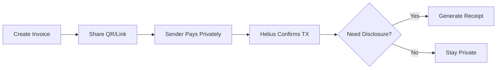

# StealthPay

Private USDC payments on Solana — with optional selective disclosure

> **"Privacy by default. Proof by choice."**

StealthPay enables cash-like private payments using USDC on Solana, while still allowing recipients to generate compliance-ready receipts only when required.

---

## Screenshots

| Invoice Form | QR Payment Link | Receipt Page | Explorer (Hidden Amount) |
|:------------:|:---------------:|:------------:|:------------------------:|
|  |  |  |  |
| Create invoices with amount, recipient, notes, and optional compliance | Shareable QR code for private payment links | Confirmation with privacy status and selective disclosure | On-chain transaction with hidden transfer amount |

> **Note**: Screenshots should be added to `docs/screenshots/` folder showing the live app flow.

---

## Problem

Most crypto payments are:

* **Fully public** — sender, receiver, and amount are visible on-chain
* **Permanently traceable** — histories are immutable and linkable
* **Misaligned with real-world privacy norms** — cash does not expose counterparties

At the same time, businesses and institutions still need:

* **Proof of payment** — verifiable transaction evidence
* **Compliance options** — screening and auditability
* **Selective disclosure** — control over when details are revealed

---

## Solution

StealthPay delivers:

| Feature | Description |
|---------|-------------|
| ✅ **Privacy by default** | Payments are sent privately using Solana privacy rails |
| ✅ **Disclosure by choice** | Recipients opt-in to reveal details when needed |
| ✅ **Compliance without surveillance** | Screening and proof are generated only on demand |

---

## How It Works

### 1. Create Payment Request

* Recipient creates an invoice (amount, note, expiry)
* A payment link + QR code is generated
* Link can be shared via text, email, or messaging apps

### 2. Sender Pays Privately

* Sender opens the link and connects a wallet
* Payment is sent privately (amount hidden on-chain)
* Uses the Privacy Cash SDK for private transfers

### 3. Confirmation

* Transaction is confirmed using Helius RPC
* Receipt page shows status, timestamp, and privacy state
* On-chain observers cannot see the amount

### 4. Optional Selective Disclosure

* Recipient can click "Generate Disclosure Receipt"
* Receipt reveals: amount, parties, timestamp, tx signature
* Disclosure includes a deterministic hash for verification
* Default state remains private

---

## USDC Handling & Privacy Architecture

> [!IMPORTANT]
> **Privacy Cash SDK Core**: The Privacy Cash protocol is primarily designed for **SOL shielding** using zero-knowledge proofs.

### Current Implementation (Hackathon MVP)

StealthPay is architected for private USDC transfers using the Privacy Cash SDK's SPL token interface:

```
Sender USDC → depositSPL() → [Shielded Pool] → withdrawSPL() → Recipient USDC
```

**How it works:**
- The SDK's `depositSPL` and `withdrawSPL` functions are used to handle USDC transfers
- Amounts are hidden on-chain during the shielded state
- The deposit→withdraw flow breaks the on-chain link between sender and recipient

### Privacy Cash SDK Status

| Capability | Status | Notes |
|------------|--------|-------|
| SOL Shielding | ✅ Production | Core Privacy Cash functionality |
| SPL Token Support | 🔄 In Development | USDC via upcoming SPL shielding support |
| USDC Wrappers | 📋 Designed | Deposit USDC → shield → withdraw USDC |

> [!NOTE]
> StealthPay is designed for **private USDC via upcoming SPL token support** from Privacy Cash. The current implementation uses the SPL interface calls, with full privacy features becoming available as the SDK matures.

---

## Features (Hackathon MVP)

- [x] Invoice creation with QR code
- [x] Private payment flow
- [x] Wallet-based UX
- [x] Receipt with Helius confirmation
- [x] Selective disclosure JSON + hash
- [x] Compliance screening (Range API)
- [ ] On-chain invoice registry (future)
- [ ] Mobile PWA (future)

---

## Demo Mode vs Production Mode

| Mode | Description |
|------|-------------|
| **Demo (Hackathon)** | Server-side relayer wallet executes private transfers. Simplifies testing, no wallet setup friction. No private keys exposed to client. |
| **Production** | Users sign deposit/withdraw directly from their own wallets. Relayer optional (broadcast/proving only). Architecture already supports this swap. |

---

## Technology Stack

| Layer | Technology | Purpose |
|-------|------------|---------|
| Frontend | Next.js 14 + Tailwind CSS | App Router, responsive UI |
| Wallet | Solana Wallet Adapter | Multi-wallet support |
| Payments | Privacy Cash SDK | Private SPL transfers |
| RPC | Helius | Transaction confirmations |
| Compliance | Range API | Sanctions/blacklist screening |
| Storage | localStorage | Demo invoice storage |
| Chain | Solana Devnet | Development network |

---

## Dependencies

### Production Dependencies

| Package | Version | Purpose |
|---------|---------|---------|
| `react` | ^18.2.0 | UI framework |
| `react-dom` | ^18.2.0 | React DOM bindings |
| `next` | ^14.2.0 | Full-stack React framework |
| `uuid` | ^9.0.0 | Invoice ID generation |
| `@solana/web3.js` | ^1.95.0 | Solana blockchain SDK |
| `@solana/wallet-adapter-base` | ^0.9.25 | Wallet adapter core |
| `@solana/wallet-adapter-react` | ^0.15.35 | React wallet hooks |
| `@solana/wallet-adapter-react-ui` | ^0.9.36 | Wallet UI components |
| `@solana/wallet-adapter-wallets` | ^0.19.19 | Wallet implementations |
| `qrcode.react` | ^3.1.0 | QR code generation |
| `@privacy-cash/privacy-cash-sdk` | github:Privacy-Cash/privacy-cash-sdk | Private payment rails |

### Dev Dependencies

| Package | Version | Purpose |
|---------|---------|---------|
| `typescript` | ^5.3.0 | Type safety |
| `@types/node` | ^20.0.0 | Node.js types |
| `@types/react` | ^18.2.0 | React types |
| `@types/react-dom` | ^18.2.0 | React DOM types |
| `autoprefixer` | ^10.4.0 | CSS vendor prefixing |
| `postcss` | ^8.4.0 | CSS transformations |
| `tailwindcss` | ^3.4.0 | Utility-first CSS |
| `eslint` | ^8.0.0 | Code linting |
| `eslint-config-next` | ^14.2.0 | Next.js ESLint rules |

---

## Getting Started

### Prerequisites

* Node.js 22+ (SDK recommends 24+)
* npm or pnpm

### Installation

```bash
npm install
```

### Environment Variables

Create a `.env.local` file:

```env
NEXT_PUBLIC_HELIUS_RPC_URL=https://devnet.helius-rpc.com/?api-key=YOUR_KEY
NEXT_PUBLIC_USDC_MINT=<devnet-usdc-mint-address>
PRIVACY_PAYER_SECRET=<base58-encoded-keypair-for-demo-relayer>
```

### Development

```bash
npm run dev
```

Visit http://localhost:3000

---

## Usage Flow



1. **Create Invoice** — amount, recipient, optional compliance
2. **Share Link / QR** — send to payer
3. **Pay Privately** — wallet connects, amount hidden
4. **Confirm Receipt** — Helius confirms transaction
5. **Optional Disclosure** — generate compliance receipt if needed

---

## Architecture

### Frontend (Next.js App Router)

```
/app
  /page.tsx               → Create invoice
  /pay/[id]/page.tsx      → Private payment
  /receipt/[id]/page.tsx  → Confirmation & disclosure
```

### Backend (API Routes)

```
/api
  /privacy/pay      → Privacy Cash deposit + withdraw
  /range/sanctions  → Range sanctions/blacklist check
```

### Storage (Demo)

* Invoice metadata: `localStorage`
* Disclosure receipts: JSON (hashable, exportable)

---

## Integration Notes

### Privacy Cash

* Provides private SPL transfers via shielded pools
* Hides amounts from the public ledger
* Deposit → withdraw flow breaks linkability
* **SDK Source**: [github:Privacy-Cash/privacy-cash-sdk](https://github.com/Privacy-Cash/privacy-cash-sdk)

### Helius

* `getTransaction` used for confirmations
* Supports sponsor prize eligibility
* Provides reliable devnet RPC

### Range

* Optional compliance screening per invoice
* Results embedded in disclosure receipts
* Enables compliant privacy workflows

---

## Prize Alignment

| Track | Alignment |
|-------|-----------|
| ✅ Private Payments Track | Core privacy-first payment flow |
| ✅ Privacy Cash Sponsor Prize | SDK integration for shielded transfers |
| ✅ Range Compliant Privacy Prize | Optional sanctions screening |
| ✅ Helius Sponsor Prize | RPC confirmation integration |

---

## What's Next

* 📱 Mobile PWA + NFC payments
* 🔍 Verifier dashboard for disclosed receipts
* 📄 PDF receipt export
* ⚓ On-chain invoice registry (Anchor)
* ⚖️ Privacy Cash Rebalancer integration
* 🪙 Full SPL token privacy when SDK support launches

---

## License

MIT
